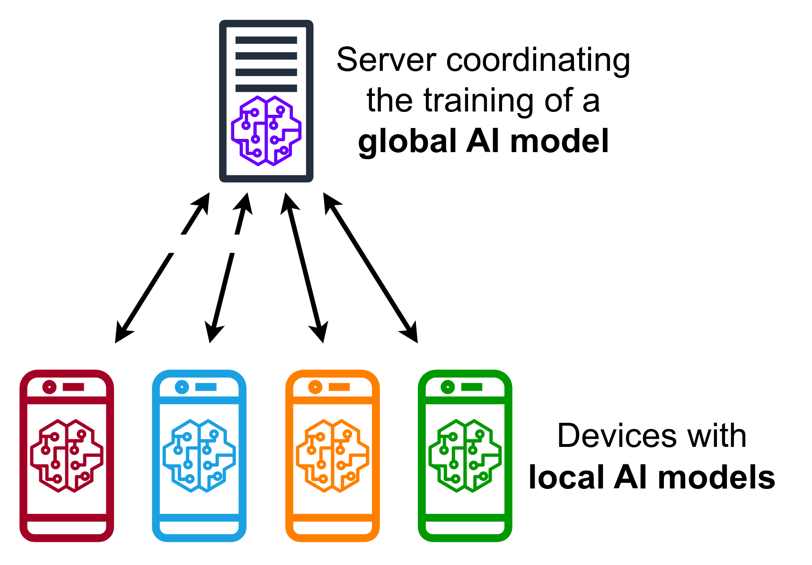

# Federate Learning 

## Description

This project serves as a proof of concept for a simple Federated Learning (FL) system. It uses Python sockets for communication between clients and a server and PyTorch for model training. Federated Learning is a decentralized machine learning approach that allows multiple clients to collaboratively train a global model without sharing their private data



## Dependencies

- python 3.11.5
- torch 2.0.1
- torchvision 0.15.2

## Video demonstration

[Demonstration](https://www.youtube.com/watch?v=wjzDCi80uUw)

## Clonning

clone the repo:

```sh
git clone https://github.com/mochaeng/FL-System.git
```

install the dependecies. Use a virtual env (prefered way) to not install globally:

```sh
pip install torch torchvision
```

## Running

#### Server
To start the **server** run:

```sh
python fl_server.py --server-port=50052
```

###### Arguments:

- **'--server-port'**: The port for the FL server;
- **'--num-rounds'**: Number of rounds the server will conduct in the trainning process;
- **'--time-to-wait'**: Time in seconds to wait for new clients before the trainning process start;
- **'--use-cuda'**: Choose if you want to use Cuda during the training proccess. Default to True;
- run **'--help'** to see the options.

#### Client

open a new terminal window for each **client** and run:

```sh
python fl_client.py --client-id=1 --server-port=50052
```

###### Arguments

- **'--client-id'**: (Required) The ID of your client. Must be between 1 and 5;
- **'--server-port'**: The port for the FL server;
- **'--use-cuda'**: Choose if you want to use Cuda during the training proccess. Default to True.

#### General 

- If you want to use Cuda in the training process, both **client** and **server** need to use Cuda as well. (Default behavior)
- Each client **ID** must be between [1..5]
- run **--help** in each _server_ and _client_ to see the possible options.


## Workflow

After the first client connected, the server will wait the amount of **'--time-to-wait'** (default 10) seconds for new clients to connect, then the trainning process start. If a client tries to connect after the trainning start, it would not be allowed to participate.

## Message protocol

Every message exchange between client and server have the following pattern:

#### Sending 

- Specify a header
- Encode with json or pickle
- Pack the message lenght in big-endian ('>Q')
- Send the message lenght
- Then send the actual message

```python
data = {
    'header': '<YOUR_HEADER>',
    'data_you_want': ...
}

serialized_data = json.dumps(data).encode()
msg_len = struct.pack('>Q', len(serialized_data))
socket.sendall(msg_len)
socket.sendall(serialized_data)
```

#### Receiving

- Receives the lenght packet
- Unpack the size of the message
- Use the receiver method to read the entire message
- Then deserializes the data

```python
length_packet = socket.recv(8)
msg_len = struct.unpack('>Q', length_packet)[0]
data = receiver(socket, msg_len)
deserialized_data = json.loads(data)
```

## Structure

##### Files

- [fl_client.py](fl_client.py): The code for the client;
- [fl_server.py](fl_server.py): The code for the server;
- [client_helper.py](client_helper.py): Read the data for the client and create the tensors
- [neural_net_helper.py](neural_net_helper.py): Code for training, test and calculate the trainning loss
- [socket_methods.py](socket_methods.py): Code for receiving large stuff on a socket
